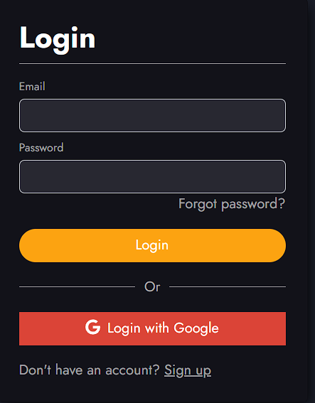

# <h1 align="center">Blink :iphone: </h1>

### 📋 Table of Contents

- [🎥 Demo](https://enjaeantonio.github.io/blink)
- [🔒 Login Page](#🔐-login-page) 
- [🏠 Home Page](#🏠-home-page) 

## Welcome to Blink! :wave:

Blink is a messaging app inspired by Telegram and created by me Enjae Antonio! Feel free to checkout the demo and try out the chat feature!

## 🏠 Home Page

Desktop view:

Mobile view: 

## 🔐 Login Page

## Languages and Tools 

